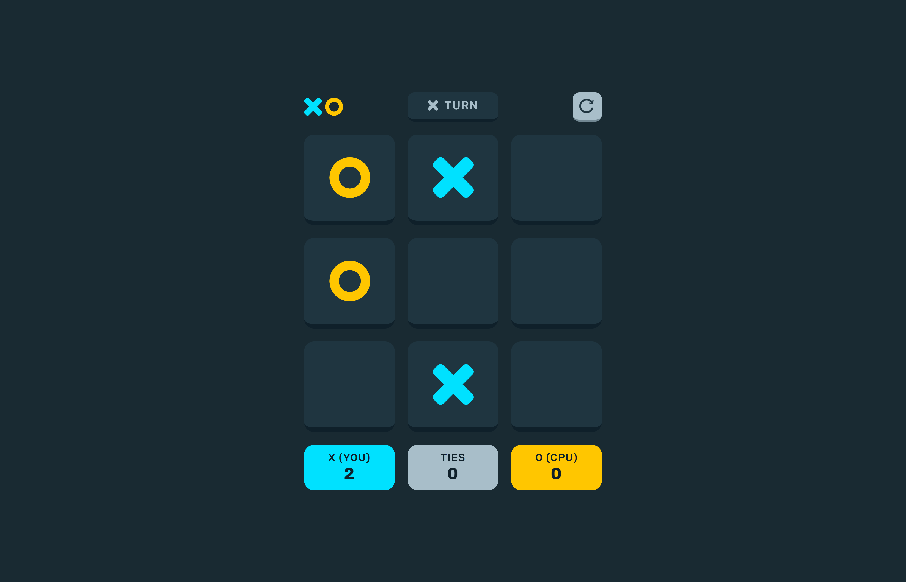
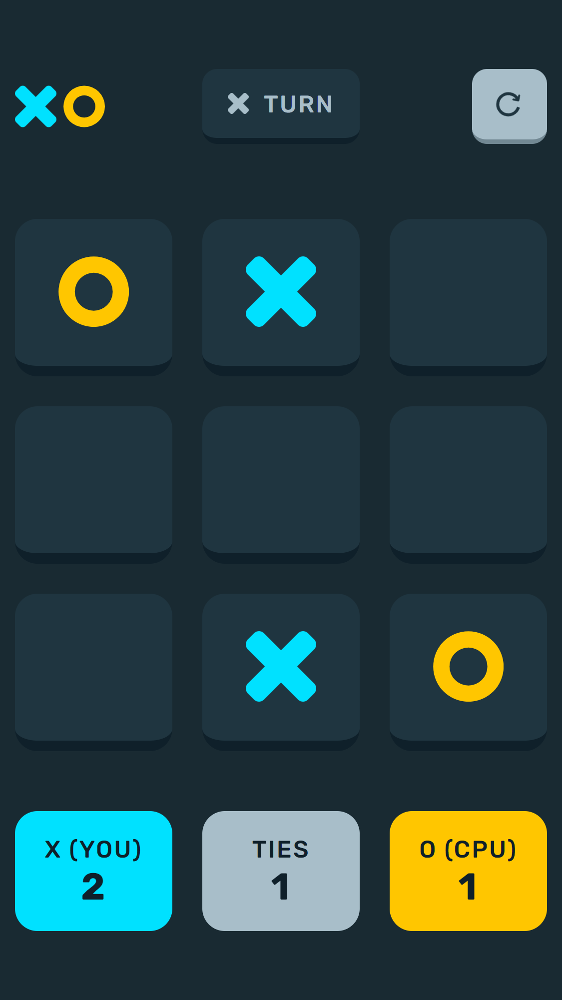

# Design System

## Table of contents

-  [Overview](#overview)
   -  [Features](#features)
   -  [Rules](#rules)
   -  [Screenshots](#screenshots)
   -  [Links](#links)
-  [Design of the System](#design-of-the-system)
   -  [UI](#ui)
      -  [Design of the header](#design-of-the-header)
      -  [Design of the grid](#design-of-the-grid)
      -  [Design of the scoreboard](#design-of-the-scoreboard)
      -  [Design of the banner](#design-of-the-banner)
   -  [JavaScript and Logic](#javascript-and-logic)
      -  [Filling in a cell](#filling-in-a-cell)
      -  [Computer turn](#computer-turn)
      -  [Checking for winner](#checking-for-winner)
      -  [Scoreboard](#scoreboard)
      -  [Reset](#reset)

### Features

Users should be able to:

- View the optimal layout for the game depending on their device's screen size
- Play tic tac toe against the computer
- Maintain the game's score state after refreshing the browser
- Reset the score/board

### Rules

The rules of this tic tac toe game are simple. The user is presented with an empty 3 by 3 grid. The user will click on a cell in a grid to place an "X", attempting to get 3 cells with an "X" to match (horizontally, vertically, diagonally). Each time the user places an "X", the computer opponent will place an "O", also trying to get 3 in a row. Whoever gets 3 in a row first wins. If neither the player or computer opponent gets 3 in a row, the round is a draw. Winning a round gets you a point.

### Screenshots

***Desktop Layout*** (1440 X 900)\

***Tablet Layout*** (768 x 1024)\

***Mobile Layout*** (375 x 667) \

### Links

- Repository URL: [Github Respository](https://github.com/JasDhindsa/tictactoe)

## Design of the System

The design of the system can be grouped into the following components:
- UI
   - Design of the header
   - Design of the grid
   - Design of the scoreboard
- JavaScript and logic
   - Filling in a cell
   - Computer turn
   - Checking for winner
   - Scoreboard
   - Reset

### UI

#### Design of the header

#### Design of the grid

#### Design of the scoreboard

#### Design of the banner

### JavaScript and Logic

#### Filling in a cell
When a player fills in a cell, they do so by triggering a click event on any one of the cells in the grid. One of two thing can happen:
- The cell is occupied, meaning it has either an x or o in it
   - In this case, the css property "pointer-events" will be set to "none", disallowing the user to trigger a click event on the cell
- The cell is empty
   - In this case, the cell has the css class added to either display an "x" or "o" (depending on the player's turn)
   - A count of the number of total filled cells in the grid is incremented
   - A count of the player's filled cells on the current row and column is incremented
      - Each player, both the user and the cpu have an array "rows" and "columns" where rows[i] and columns[i] represent the number of "x"s and "o"s, respectively (0 <= i <= 3)
   - All of these pieces of information will be used to determine the game result

#### Computer turn
- After a the player fills in a cell and has their turn, the entire program waits 1.5 seconds (using async/await) to simulate the computer thinking. - The computer then fills in a cell with the exact same mechanism as the user filling a cell
- During the computer's turn, pointer events on the grid are desabled for the user

#### Checking for game result
- The game can either end in the user winning, the computer winniing, or the round ending in a draw
   - User winning:
      - Each time the user places a cell, the number of filled in cells across the current row, the current column, and both diagonals are checked to see if they equal 3 (which then indicates 3 in a row)
      - If it does equal 3, the winning cells are highlighted and then the win banner appears
   - Computer winning:
      - The mechanism is the same as the user winning
   - Draw:
      - When a draw occurs, the variable that keeps track of the number of filled cells is found to be equal to the total number of cells
      - In this case, it is then known that all cells are full and no 3 in a row has been found
      - The draw banner appears

#### Scoreboard
- The scoreboard has 3 variables: The player score, the number of ties, and the computer score
- These values are incremented depending on the game result
- By using the local storage, the game scores can be stored on the local machine to be able to persist between different sessions of running the application

#### Reset
- The game reset feature is used to clear the board and reset all variables to their default initial values
- This includes:
   - Removing all classes from the cells that pertain to the filled in symbol (x or o)
   - Setting the number of filled in cells to 0
   - Setting the number of filled in player cells and computer cells across all rows and columns to 0
   - Setting the player score, number of ties, computer score to 0 (and subsequently the corresponding local storage values to 0)
